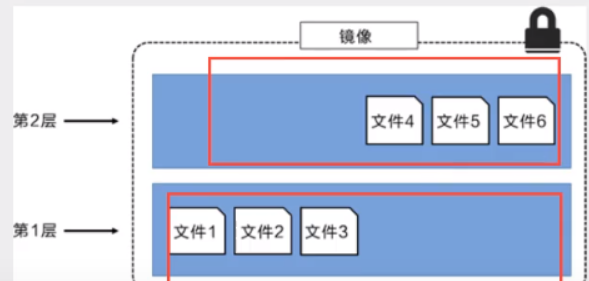
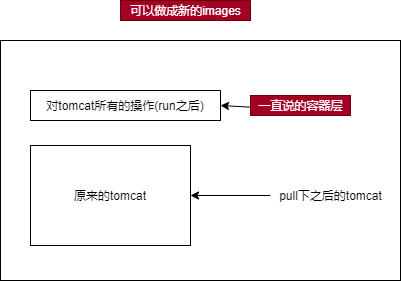

## Docker的基本组成

1. 镜像时一种轻量级,可执行的独立软件包,用来打包软件运行环境和基于运行环境开发的软件,它包含运行某个软件所需的所有内容,包括代码,环境运行时,库,环境变量等
2. **容器(container)**:Docker利用容器技术,独立运行一个,或者一组应用,通过镜像来创建
   * 容器可以启动,停止,删除等基本命令
   * 可以简单理解为一个简单的linux系统
3. **仓库(repository)**:存放镜像的地方(分为私有和公有)
   * 由于Docker hub是国外的(配置镜像加速)

### 安装Docker

>官方文档:<https://docs.docker.com/engine/install/centos/>

1. 安装`yum-utils`包:`yum install -y yum-utils`
2. 设置镜像的库:
   * `yum-config-manager`是一个程序,它可以管理主要的yum配置选项,切换启用或禁用的存储库,以及添加新的存储库
   * `使用--add-repo快速添加yum源`

   ```shell
   yum-config-manager \
   --add-repo \
   https://download.docker.com/linux/centos/docker-ce.repo
   ```

3. 更新软件包的索引Centos 8:`yum makecache`,如果是7:`yum makecache fast`

4. 安装docker相关的源(`docker-ce`社区版,ee 企业版)

   ```shell
   yum install docker-ce docker-ce-cli containerd.io
   ```
  
   > 如果安装特定版本的docker`yum install docker-ce-<VERSION_STRING> docker-ce-cli-<VERSION_STRING> containerd.io`

5. 启动docker:`systemctl start docker`
6. 使用`docker version`是否安装成功
7. 测试:`docker run hello-world`
8. 查看下载的镜像:`docker images`

   ```shell
   [root@VM-12-17-centos /]# docker images
   REPOSITORY    TAG       IMAGE ID       CREATED        SIZE
   hello-world   latest    feb5d9fea6a5   3 months ago   13.3kB
   ```

9. 卸载docker

   ```shell
   # 卸载依赖
   yum remove docker-ce docker-ce-cli containerd.io
   # 删除资源
   rm -rf /var/lib/docker # docker的默认工作路径
   rm -rf /var/lib/containerd # https://www.51cto.com/article/677744.html
   ```

### 配置镜像加速

> 在阿里云的`容器服务里`找到`容器镜像服务`,打开`镜像工具`,打开`镜像加速器`

```shell
mkdir -p /etc/docker
tee /etc/docker/daemon.json <<-'EOF'
{
  "registry-mirrors": ["https://xxxxxx.mirror.aliyuncs.com"]
}
EOF
systemctl daemon-reload
systemctl restart docker
```

### docker的工作原理

> helloword的运行原理


* 工作流程:
  1. Docker是一个Client-Server结构的系统,Docker的守护进程运行在主机上.通过Socket从客户端访问
  2. `DockerServe`接收到`Docker-Client`的指令就会执行这个命令


* docker与虚拟机对比


1. Docker有比虚拟机更少的抽象层
2. docker利用是宿主机的内核,虚拟机是需要Guest OS
3. docker不需要像虚拟机一样重新加载一个操作系统的内核,避免引导.虚拟机时加载Guset OS,分钟级别的,docker时利用宿主机操作系统,省略了这个复杂的功能

 |            | Docker容器  | LXC         | VM           |
 | ---------- | ----------- | ----------- | ------------ |
 | 虚拟化类型 | OS虚拟化    | OS虚拟化    | OS虚拟化     |
 | 性能       | =物理机性能 | =物理机性能 | 5%-20%的损耗 |
 | 隔离性     | NS隔离      | NS隔离      | 强           |
 | QoS        | Cgroup弱    | Cgroup弱    | 强           |
 | 安全性     | 中          | 差          | 强           |
 | GusetOS    | 只支持Linux | 只支持Linux | 全部         |
 | 可迁移性   | 强          | 弱          | 强           |

### **镜像(image)**

>镜像时一种轻量级,可执行的独立软件包,用来打包软件运行环境和基于运行环境开发的软件,它包含运行某个软件所需的所有内容,包括代码,环境运行时,库,环境变量等

1. 例如`tomcat镜像`运行起来之后`tomcat01容器`来提供服务
2. 并且这个镜像可以创建多个容器(最终服务运行或者项目运行实在容器中)
3. 所有的应用通过docker应用打包,可以直接跑起来

> 镜像获取的方法

1. 从远程仓库下载
2. 拷贝别人的镜像
3. 自己制作一个`DockerFile`

#### Docker镜像加载的基本原理

> UnionFS(联合文件系统):下载的时候一层一层的输出就是这个

* **UnionFS(联合文件系统)**:Union文件系统(UnifonFS)是一种分层,分量级并且高性能的文件系统,它支持对文件系统的修改作为一次提交来一层层的叠加,同时可以将不同的目录挂载到一个虚拟文件系统下(`unite serveral directories into a single virtual filesystem`).Union 文件系统时Docker镜像的基础,镜像可以通过分层类进行继承,基于镜像(没有父镜像),可以制作各种具体的应用镜像
* **特性**:一次同时加载多个文件系统,但是从外面看只能看到一个文件系统,联合加载会把各层文件系统叠加起来,这样<span style="color:red">最终文件系统会包含所有底层的文件和目录</span>(例如底层的centos文件会给所有的容器使用)

> Docker 镜像加载原理

* docker镜像实际室友一层一层文件系统组成
* **bootfs(boot file system)**:包含bootloader和kernel.`bootloader`主要加载`kernel`.Linux刚启动会加载bootfs文件系统,在Docker镜像最底层就是bootfs,并且与典型的Linux/Unix系统是一样的,包含bootf加载器和内核.当bootf加载完成之后整个内核就在**内存**中,此时的内存使用权就有bootfs转交给内核,系统卸载bootfs
* **rootfs(root file system)**:在bootfs之上.包含的就是典型的Linux系统中的`/dev,/bin,/usr`等.rootfs就是不同操作系统的发行版,比如`Ubuntu`,`Centos`等


* 对于精简过的OS(操作系统),rootfs可以很小,只需要最基本的命令.工具和程序库就可以了,底层使用主机的内核就可以了,自己只需要提供rootfs.

> 分层理解

1. 所有的Docker镜像都起始于一个基础镜像,当金星修改或增加新的内容时,就会在当前的镜像层之上,创建新的镜像层
   * 例如Centos创建一个新的镜像,此镜像位于第一层,如果在该镜像中加入Python包,就会在基础镜像层上创建第二个镜像层;如果继续添加,就会创建第三个镜像层
2. 在添加额外镜像的同时,镜像始终保持所有镜像的组合.
   * 例如下图中,每个层中都有三个文件,且保持相互隔离


> 特点

1. docker镜像都是只读的,当容器启动,一个新的科协曾被加载到镜像的顶部
2. 这一层通常是容器层,容器之下都是镜像层

 

### Commit镜像

1. `docker commit -m="提交信息" -a="作者"` 提交容器成为一个新的副本
2. 可以使用`docker images`,查看自己保存的镜像

## Docker常用命令

>参考文档:<https://docs.docker.com/reference/>

### 帮助命令

1. `docker version`:显示docker的版本信息
2. `docker info`:显示docker的系统信息,包括镜像和容器的数量
3. `docker 命令 --help`:帮助命令

### 镜像命令

* `docker images`:查看所有本地主机上的镜像

```shell
[root@VM-12-17-centos /]# docker images
REPOSITORY    TAG       IMAGE ID       CREATED        SIZE
hello-world   latest    feb5d9fea6a5   3 months ago   13.3kB

# 可选项
  -a, --all     # 列出所有的镜像
  -q, --quiet   # 只显示镜像的ID  
```

1. `REPOSITORY`:镜像的仓库源
2. `TAG`:镜像的标签
3. `IMAGE ID`:镜像的ID
4. `CREATED`:镜像的创建时间
5. `SIZE`:镜像的大小

* `docker search 镜像`:搜索镜像

```shell
[root@VM-12-17-centos /]# docker search mysql
NAME                              DESCRIPTION                                     STARS     OFFICIAL   AUTOMATED
mysql                             MySQL is a widely used, open-source relation…   11997     [OK]       
mariadb                           MariaDB Server is a high performing open sou…   4595      [OK]       
mysql/mysql-server                Optimized MySQL Server Docker images. Create…   899                  [OK]

# 可选项,通过搜索来过滤
--filter = STARS = 3000  搜索出的镜像是STARS>3000的
```

* `docker pull`下载镜像

```shell
# 下载镜像 docker pull 镜像名[:tags]
[root@VM-12-17-centos /]# docker pull mongo
Using default tag: latest # 如果不屑tag,默认就是latest
latest: Pulling from library/mongo
7b1a6ab2e44d: Pull complete # 分层下载,docker image的核心  联合文件系统
90eb44ebc60b: Pull complete 
5085b59f2efb: Pull complete 
c7499923d022: Pull complete 
019496b6c44a: Pull complete 
c0df4f407f69: Pull complete 
351daa315b6c: Pull complete 
a233e6240acc: Pull complete 
a3f57d6be64f: Pull complete 
dd1b5b345323: Pull complete 
Digest: sha256:5be752bc5f2ac4182252d0f15d74df080923aba39700905cb26d9f70f39e9702 # 签名
Status: Downloaded newer image for mongo:latest
docker.io/library/mongo:latest # 真实地址

# 下面两者等价
docker pull docker.io/library/mongo:latest
docker pull mysql

# 指定版本下载
docker pull mongo:3.1
```

* `docker rmi`:删除镜像

```shell
docker rmi -f 镜像id # 删除指定的镜像
docker rmi -f 镜像id 镜像id   # 删除多个指定的镜像
docker rmi -f $(docker images -aq) # 删除全部的镜像
```

### 容器命令

<hr></hr>

> 下载centos镜像来测试`docker pull centos`

#### 新建容器并启动

* **docker run [可选参数] image**

> 参数说明

* --name="Name" 容器名字 tomcat01 tomcat01,用来区分容器
* -d            后台方式运行
* -it           使用交互方式运行,进入容器看内容
* -p            指定容器的端口 -p 8080:8080
  * -p ip:主机端口:容器端口
  * -p 主机端口:容器端口   (常用)
  * ip 容器端口
  * 容器端口
* -P            随机指定端口

```shell
# 测试,启动并进入容器
[root@VM-12-17-centos /]# docker run -it centos /bin/bash
[root@12164c10567a /]# ls
bin  dev  etc  home  lib  lib64  lost+found  media  mnt  opt  proc  root  run  sbin  srv  sys  tmp  usr  var
```

#### 列出所有的运行容器

* **docker ps**:列出正在运行的容器
  * `-a`:列出正在运行的容器并带出历史运行过的容器
  * `-n=?`:显示最近创建过的容器,例如`-n=1`显示最近的一个容器
  * `-q`:只显示容器编号

#### 退出容器

* **exit**:直接退出容器并停止
* `Ctrl+P+Q`:容器不停止退出

#### 删除容器

* **docker rm 容器id**:删除镜指定的容器,不能删除正在运行的容器,如果强制删除`rm -f`

```shell
docker rm -f $(docker ps -aq) # 删除全部的容器
docker ps -a -q|xargs docker rm   # 删除所有的容器
```

#### 启动和停止容器的操作

* **docker start  容器id**:启动容器
* **docker restart 容器id**:重启容器
* **docker stop 容器id**:停止当前容器
* **docker kill 容器id**:强制停止容器

### 常用的其它命令

#### 后台启动容器

* **docker run -d 镜像名**

```shell
[root@VM-12-17-centos /]# docker run -d centos

# docker ps:发现centos停止了
```

* 常见的问题:
  1. <span style="color:red">docker容器使用后台运行,就必须有一个前台进程,docker发现没有应用,就会自动停止</span>
  2. 例如nginx容器启动后,发现自己没有提供服务就会自动停止

#### 查看日志

* **docker -f -t --tail**
  * `-f`:显示日志
  * `-t`:带上时间戳
  * `--tail`:显示多少条日志

```shell
docker -f -t --tail 10 af1770f5884f
```

#### 查看容器内部的进程命令

* **docker top 容器id**

```shell
[root@VM-12-17-centos ~]# docker top 4fc2d1f7bf97
UID                 PID                  PPID    C         STIME               TTY                 TIME                CMD
root                12339               12319    0        15:58               pts/0               00:00:00            /bin/bash              
```

#### 查看容器的元数据(重要)

* **docker inspect 镜像/容器id**

```shell
[root@VM-12-17-centos ~]# docker inspect 7a447721e405
```

#### 进入当前正在运行的容器

>通常容器都是使用后台方式运行.需要进入容器修改一些配置

* **docker exec -it 容器id bashShell**/**docker attach 容器id**

1. 第一种:`docker exec -it 7a447721e405 /bin/bash`
2. 第二种:`docker attach 7a447721e405`

* 注意:<span style="color:red">第一个是进入容器后开启一个新的终端,第二个是进入一个容器正在执行的终端</span>

#### 从容器中拷贝到主机上

* **docker cp**

>将已经停止的容器中的内容拷贝到主机

```shell
[root@VM-12-17-centos /]# docker cp 7a447721e405:/home/test.md /home
```

>使用-v卷的技术可以实现自动同步

#### 查看cpu状态

* **docker stats**:查看docker的cpu状态

### 总结

| 命令    | 原文                                                               | 译                                                                                  |
| ------- | ------------------------------------------------------------------ | ----------------------------------------------------------------------------------- |
| attach  | Attach to a running container                                      | 当前shel11下attach连接指定运行镜像                                                  |
| build   | Build an image from a Dockerfile                                   | 通过Dockerfile 定制镜像                                                             |
| commit  | Create a new image from a container changes                        | 提交当前容器为新的镜像                                                              |
| cp      | Copy files/folders from the containers filesystem to the host path | 从容器中拷贝指定文件或者目录到宿主机中                                              |
| create  | Create a new container                                             | 创建一个新的容器,同run, 但不启动容器                                                |
| diff    | Inspect changes on a container's filesys tem                       | 查看docker容器变化                                                                  |
| events  | Get rea1 time events from the server                               | 从docker 服务获取容器实时事件                                                       |
| exec    | Run a command in an existing container                             | 在已存在的容器 上运行命令                                                           |
| export  | Stream the contents of a container as a tar archive                | 导出容器的内容流作为一个tar归档文件[对应import ]                                    |
| history | Show the history of an image                                       | 展示一个镜像形成历史                                                                |
| images  | List images                                                        | 列出系统当前镜像:                                                                   |
| import  | Create a new filesystem image from the contents of a tarba1l       | 从tar包中的内容创建一个新的文件系统镜像[对应export]                                 |
| info    | Display sys tem-wide i nformation                                  | 显示系统相关信息                                                                    |
| inspect | Return 1ow-1eve1 information on a container                        | 查看容器详细信息                                                                    |
| kill    | Ki11 a running container                                           | ki1l 指定docker 容器                                                                |
| load    | Load an image from a tar archive                                   | 从一个tar包中加载一个镜像[对应save]                                                 |
| login   | Register or Login to the docker registry server                    | 住册或者登陆一个docker源服务器                                                      |
| logout  | Log out from a Docker registry server                              | 从当前Docker registry 退出                                                          |
| 1ogs    | Fetch the 1ogs of a container                                      | 输出当前容器日志信息                                                                |
| port    | lookup the public-facing port which is NAT-ed to PRIVATE_ PORT     | 查看映射端口对应的容器内部源端                                                      |
| pause   | Pause a11 processes within a container                             | 暂停容器                                                                            |
| ps      | List containers                                                    | 列出容器列表                                                                        |
| pull    | Pull an image or a repository from the docker registry server      | 从docker镜像源服务器拉取指定镜像或者库镜像                                          |
| push    | Push an image or a repository to the docker registry server        | 推送指定镜像或者库镜像至docker源服务器                                              |
| restart | Restart a running container                                        | 重启运行的容器                                                                      |
| rm      | Remove one or more : containers                                    | 移除一个或者多个容器                                                                |
| rmi     | Remove one or more images                                          | 移除一个或多个镜像[无容器使用该镜像才可删除,否则需删除相关容器才可继续或-f强制删除] |
| run     | Run a command in a . new container                                 | 创建一个新的容器并运行一个命令                                                      |
| save    | Save an image to a tar archive                                     | 保存一个镜像为一个tar包[对应load]                                                   |
| search  | Search for an image on the Docker Hub                              | 在docker hub中搜索镜像                                                              |
| start   | Start a stopped containers                                         | 启动容器                                                                            |
| stop    | Stop a running containers                                          | 停止容器                                                                            |
| tag     | Tag an image into a repository                                     | 给源中镜像打标签                                                                    |
| stats   | Display a live stream of container(s) resource usage statistics    | 查看cpu状态                                                                         |
| top     | Lookup the running processes of a container                        | 查看容器中运行的进程信息                                                            |
| unpause | Unpause a paused container                                         | 取消暂停容器                                                                        |
| version | Show the docker vers ion information                               | 查看docker版本号                                                                    |
| wait    | B1ock until a container stops, then print its exit code            | 截取容器停止时的退出状态值                                                          |

## 案列

> 以装nginx为例

1. 搜索镜像:`docker search nginx`(dockerhub更方便)
2. 下载镜像:`docker pull nginx`
3. 查找镜像:`docker images`
4. 以后台方式运行容器,改名并且映射端口后:`docker run -d --name nginx01 -p 3401:80 nginx`
5. 查看运行的容器:`docker ps`
6. 测试容器是否成功:`curl localhost:3401`
7. 进入容器内部:`docker exec -it nginx01 /bin/bash`
8. 停止容器:`docker stop nginx01`
9. 删除指定容器:`docker rm nginx01`


>安装`tomcat`

```shell
# 官网使用命令
docker run -it --rm -p 8888:8080 tomcat:9.0
```

1. nginx的案列是启动在后台,停止了容器还是可以查到.
2. `docker run -it --rm`:`--rm`一般用来测试,用完就会被删除

## 容器数据卷

>Docker 容器中产生的数据,同步到本地.本地的数据也可以在容器中查看

1. 容器和主机可以数据共享
2. 容器和容器之间也可以数据共享

>* windows:`docker run -it -v /d/test:/home centos`,路径要和linux的风格相同
>* linux: `docker run -it -v /home/test:/home centos`
>* 解释一下linux的吧:就是将**容器中**`/home`目录下的文件同步到**主机中**`/home/test`

* 使用`docker inspect`:查看容器的详细信息

```shell
# 挂载
"Mounts": [
    {
        "Type": "bind",
        "Source": "/d/test", # 主机内地址
        "Destination": "/home", # docker容器的地址
        "Mode": "",
        "RW": true,
        "Propagation": "rprivate"
    }
]
```

>安装mongoDB,官网:<https://hub.docker.com/_/mongo>(<span style="color:red">mongoDB的配置文件和数据文件都在/data下面</span>)

```shell
# -v:数据卷挂载
# -e:设置环境配置

# 官方安装
docker run --name some-mongo -v /my/own/datadir:/data/db -d mongo

# 自己尝试连接
docker run -d -p 27017:27017 -v /g/DBMS/mongo/data:/data -e MONGO_INITDB_ROOT_USERNAME=root -e MONGO_INITDB_ROOT_PASSWORD=123456 mongo
# 启动之后可以在本地使用连接
```

### 具名挂载和匿名挂载

1. `docker run -d -P --name nginx01 -v /etc/nginx nginx`,不指定主机的映射目录(匿名挂载)
2. `docker run -d -P --name nginx01 -v test:/etc/nginx nginx`,不指定主机的映射目录(具名挂载)
3. 查看所有的`volumn`(挂载卷)的情况

```shell
G:\>docker volume ls
DRIVER    VOLUME NAME
local     0c65a12280af5da18c06169e98ceb7493a80082ac39cf5fc5a01263958ede773
local     test
...
```

* 如果是匿名挂载,会自动映射到`"/var/lib/docker/volumes/xxx/_data"`

>使用`docker volume inspect test`可以查找挂载路径

```shell
[
 {
   "CreatedAt": "2022-01-22T10:27:43Z",
   "Driver": "local",
   "Labels": null,
   "Mountpoint": "/var/lib/docker/volumes/test/_data",
   "Name": "test",
   "Options": null,
   "Scope": "local"
 }
]
```

> 通过具名挂载可以很容易的找到一个卷,大多数情况下在使用`具名挂载`

1. `-v 容器内路径`:匿名挂载
2. `-v 卷名:容器内路径`:具名挂载
3. `-v /宿主路径:/容器内路径`:指定路径挂载

```shell
# ro ===>readonly 只读,只能通过宿主机来操作,容器内部无法操作
# rw ===>readwrite 可读可写(默认)
# 如果设置了这些权限,容器就有限定

docker run -d -P --name nginx01 -v test:/etc/nginx:ro nginx
docker run -d -P --name nginx01 -v test:/etc/nginx:rw nginx
```

## DockerFile

>很多官方的镜像都是基础包.利用dockerfile自己去搭建镜像

* 构建的大概流程
  1. 编写一个`dockerFile`文件
  2. `docker build`构建成为一个镜像
  3. `docker run`运行镜像
  4. `docker push`发布镜像(dockerhub仓库)

```shell
FROM scratch
ADD centos-8-x86_64.tar.xz /
LABEL org.label-schema.schema-version="1.0"     org.label-schema.name="CentOS Base Image"     org.label-schema.vendor="CentOS"     org.label-schema.license="GPLv2"     org.label-schema.build-date="20210915"
CMD ["/bin/bash"]
```

### DockerFile构建

1. 每个保留关键字(指令)都必须是大写字母
2. 执行从上到下的顺序
3. \# 表示注释
4. 每一个指令都会创建一个新的镜像层并提交


* `DockerFile`:构建文件,定义步骤,生成源代码
* `DockerImages`:通过`DockerFile`构建生成的镜像(最终运行和发布)
* `Docker容器`:镜像运行起来提供的服务器

> dockerFile的zhiling

| FROM               | 基础镜像,构建的开始                                                           |
| ------------------ | ----------------------------------------------------------------------------- |
| MAINTAINER(已启用) | 镜像的作者,姓名+邮箱                                                          |
| LABEL              | 代替`MAINTAINER`,LABEL指令添加元数据到一个镜像。LABEL是一个键值对(可以有很多) |
| RUN                | 构建的时刻运行的命令                                                          |
| ADD                | 步骤,需要添加的镜像文件                                                       |
| WORKDIR            | 镜像的工作目录                                                                |
| VOLUME             | 挂载的目录                                                                    |
| EXPOSE             | 暴露端口(不暴露就需要用`-p`)                                                  |
| CMD                | 指定容器启动时候要运行的命令,只有最后一个会生效,可被ENTRYPOINT替代            |
| ENTRYPOINT         | 指定容器启动时候要运行的命令,可以追加命令                                     |
| ONBUILD            | 构建一个被继承的`DockerFile`就会运行`ONBUILD`指令,触发指令                    |
| COPY               | 类似ADD,将文件拷贝到镜像中                                                    |
| ENV                | 构建的时候生成环境变量                                                        |
| SHELL              | 指定 `RUN`、`ENTRYPOINT`、`CMD` 指令的 shell                                  |

>构建centos

```shell
# 1.编写DockerFile文件
FROM centos
LABEL name="fw" email="zyj17715640603@gmail.com"
ENV MYPATH = /usr/local
WORKDIR ${MYPATH} # 进入容器之后的工作目录
RUN yum -y install vim # 添加工具
RUN yum -y install net-tools # 添加工具
EXPOSE 80 # 暴露端口
CMD /bin/bash
# SHELL ["/bin/sh", "-c"] linux 默认是此命令
# 2.通过这个构建镜像
# 命令 docker build -f (构建的DockerFile文件) -t (输出的镜像名) .

[root@VM-12-17-centos Docker]# docker build -f DockerFile  -t mycentos:0.1 .

# 3.查看镜像的构建过程`docker history 镜像名`
```

* 注意:<span style="color:red">如果直接将文件命名`Dockerfile`,那么不需要加`-f`docker会自动寻找</span>
* 使用`ADD`添加的文件会自动解压,例如`apache-tomcat-8.5.75.tar.gz`

> `CMD`和`ENTRYPOINT`的区别

* 大部分linux发行版的基础镜像里面调用CMD命名,指定容器启动后直接执行`/bin/bash`或者`/bin/sh`,这样镜像就会默认进入交互的`shell`

```shell
FROM centos
...
CMD "/bin/bash"
```

* CMD给出的是一个容器的默认可执行体,也就是容器启动以后,默认的执行命名.

* 也就是说,如果<span style="color:red">docker run没有指定的任何的执行命名或者dockfile里面也没有entrypoint</span>,那么就会执行cmd指定的默认的执行命名执行
* 有三种用法:
  1. shell格式的形式:例如`npm install`.命令默认是在`/bin/sh -c`下执行的.

     ```Dockerfile
     FROM centos
     ...
     CMD echo "hello"
     ```

     * 当我们运行`docker run...`的时候,会调用`/bin/bsah`然后打印出`hello`
  2. exec格式的形式(推荐使用):例如`["npm","install"]`.并且第一个参数必须是全路径,并且一个`dockerfile`只能有一个cmd,如果有多个,则指会后最后一个生效.
     * 上面的方式改写:`["/bin/bash","-c","echo","hello"]`
     * <span style="color:red">如果我们在run的时候指定了命令或者有entrypoint,那么cmd就会被覆盖</span>
       * `docker run ... echo "world"`,那么控制台就会打印`world`,而不是默认的hello

* `ENTRYPOINT`默认是在shell环境下执行的,与CMD有区别.
  * 如果run命名后有东西,那么全部会作为`entrypoint`的参数.
  * 如果run后面没有东西,但是CMD有,那么CMD的全部内容会作为entrypoint的参数,这同时是cmd的第三种用法

* exec形式:将CMD当作默认的参数

  ```doeckerFile
  FROM centeos
  ...
  CMD ["hello"]
  ENTRYPOINT ["echo","hello"]
  ```

  * 如果运行`doecker run ...`,会直接打印`hello hello`
  * 如果运行`docker run ... world`,那么cmd就会被覆盖,打印`hello world`

* 如果使用shell模式:shell的形式会使`ENTRYPOINT`忽略任何CMD或者docker运行的命令行参数
* 如果需要提供默认的命令或在docker容器运行时可以从命令行覆盖的参数时,使用`CMD`
* 最好的选择是使用`exec`,而不是shell命令

### 上下文

```bash
docker build -t nginx:v3 .
```

* 通常最后的路径就是指定的上下文，并不是 Dockerfile 文件所在的位置，而是打包 Dockerfile 文件内容中的位置
* 类似于 `.` 这样的，就是 docker build 所执行的位置为路径打包

```Dockerfile
COPY ./package.json /app/
```

* 如果需要指定 Dockerfile 位置，`-f ../Dockerfile`，当然它也可以是别的名称

### ONBUILD

>将项目相关的指令加上 ONBUILD，这样在构建基础镜像的时候，这三行并不会被执行

```Dockerfile
FROM node:slim
RUN mkdir /app
WORKDIR /app
ONBUILD COPY ./package.json /app
ONBUILD RUN [ "npm", "install" ]
ONBUILD COPY . /app/
CMD [ "npm", "start" ]
```

> 然后各个项目的 Dockerfile 就变成了简单地：

```Dockerfile
FROM my-node
```

### 构建 Dokerfile

> Dockerfile 中每一个指令都会建立一层，RUN 也不例外。所以我们尽量在一层做每一层该做的事，并且一定要确保每一层只添加真正需要添加的东西，任何无关的东西都应该清理掉

* 不要忘记每一层构建的最后一定要清理掉无关文件

```Dockerfile
FROM debian:stretch

RUN set -x; buildDeps='gcc libc6-dev make wget' \
    && apt-get update \
    && apt-get install -y $buildDeps \
    && wget -O redis.tar.gz "http://download.redis.io/releases/redis-5.0.3.tar.gz" \
    && mkdir -p /usr/src/redis \
    && tar -xzf redis.tar.gz -C /usr/src/redis --strip-components=1 \
    && make -C /usr/src/redis \
    && make -C /usr/src/redis install \
    && rm -rf /var/lib/apt/lists/* \
    && rm redis.tar.gz \
    && rm -r /usr/src/redis \
    && apt-get purge -y --auto-remove $buildDeps
```

>容器构建时，我们不能将它简单的使用 systemctl 或者 service 这类守护进程后台运行。

对于容器而言，其启动程序就是容器应用进程，容器就是为了主进程而存在的，主进程退出，容器就失去了存在的意义

所以正确的做法是在前台执行可执行文件

```Dockerfile
CMD ["nginx", "-g", "daemon off;"]
```

## 发布镜像

>发布到Dockerhub

1. 登录账号`docker login -u (user) -p (password)`

2. 给images打一个标签(/之前的得是docker用户名才能上传成功)
   * `denied: requested access to the resource is denied`:(可能用户名不对)

   ```shell
   docker tag divtomcat fw1314/divtomcat:v0.0.1
   ```

3. 上传到远程仓库`docker push fw1314/divtomcat:v0.0.1`
   * 提交的时候也是按层级提交

> [发布到阿里云容器](https://cr.console.aliyun.com/cn-hangzhou/instances)

1. 在阿里云容器服务中创建个人实例
2. 创建命名空间
3. 创建容器镜像(选择本地)
4. 参考`基本信息`

> 镜像的导入导出

1. `docker save`:将一个或多个**image**打包保存的工具
   * 官方:`Usage:docker save [OPTIONS] IMAGE [IMAGE...]`
   * 例如`docker save -o images.tar postgres:9.6 mongo:3.4`:将镜像库中的postgres和mongo打包
2. `docker load`:将打包后的镜像载入进来
   * 官方:`Usage:  docker load [OPTIONS]`
   * 例如:`docker load -i images.tar`把postgres:9.6和mongo:3.4载入进来,如果本地镜像库已经存在这两个镜像,将会被覆盖

> 容器的快照

1. `docker export`:将container的文件系统进行打包(只保存当时的快照)
   * 官方:`Usage:docker export [OPTIONS] CONTAINER`
   * 例如:`docker export -o postgres-export.tar postgres(指定的容器)`将正在执行的postgres容器打包
2. `docker import`
   * 官方:`docker import [OPTIONS] file|URL|- [REPOSITORY[:TAG]]`:可以指定路径和重新命名
   * 例如:`docker import postgres-export.tar postgres:latest`导入后会成为一个`image`(不会导出容器)

> 区别

1. `docker save`保存的是镜像(image),`docker export`保存的是容器(container)
2. `docker load`用来载入镜像包,`docker import`用来载入容器包,但两者都会恢复为镜像
3. `docker load`不能对载入的镜像重命名,而`docker import`可以为镜像指定新名称

>参考:<https://jingsam.github.io/2017/08/26/docker-save-and-docker-export.html>

## Docker网络

* 首先查看服务器的网络`ifconfig`,显示三个网络
  1. `docker0`:docker自己生成的地址
  2. `eth0`:服务器的内网地址
  3. `lo`:本地回环地址
* 启动一个容器,例如tomcat

```shell
[root@VM-12-17-centos /]# docker run -d -P --name tomcat01 tomcat
```

* 发现没有`ip addr`命令,进入容器`docker exec -it tomcat01 /bin/bash`
* 下载`apt update && apt install -y iproute2`
* 查看容器内部的网址结构`docker exec -it tomcat01 ip addr`

```shell
1: lo: <LOOPBACK,UP,LOWER_UP> mtu 65536 qdisc noqueue state UNKNOWN group default qlen 1000
    link/loopback 00:00:00:00:00:00 brd 00:00:00:00:00:00
    inet 127.0.0.1/8 scope host lo
       valid_lft forever preferred_lft forever
8: eth0@if9: <BROADCAST,MULTICAST,UP,LOWER_UP> mtu 1500 qdisc noqueue state UP group default 
    link/ether 02:42:ac:11:00:02 brd ff:ff:ff:ff:ff:ff link-netnsid 0
    inet 172.17.0.2/16 brd 172.17.255.255 scope global eth0
       valid_lft forever preferred_lft forever
```

* `ping 172.17.0.2`:宿主机可以ping通容器

>原理

1. 当我们启动一个容器的时候,docker就会给我们分配一个ip,只要安装docker,就会有一个网卡`docker0`
2. 网卡使用的是桥接模式
3. 当我们再次`ifconfig`

   ```shell
   # 多出来的网络
   9: veth9c8db14@if8: <BROADCAST,MULTICAST,UP,LOWER_UP> mtu 1500 qdisc noqueue master docker0 state UP group default 
      link/ether a2:d2:1c:d0:7f:6a brd ff:ff:ff:ff:ff:ff link-netnsid 0
      inet6 fe80::a0d2:1cff:fed0:7f6a/64 scope link 
         valid_lft forever preferred_lft forever
   ```

   >多出来的网卡是按对出现的.`evth-pair`一段连着协议,一段彼此相连.`evth-pair`充当一个桥梁,彼此相连

4. 没有ping包.下载:`apt install iputils-ping`
5. 再启动一个tomcat,`tomcat01`ping`tomcat02`(发现可以ping通)


1. tomcat01和tomcat02是公用的一个路由器(`docker0`)
2. 所有的容器再不指定网络的情况下,都是docker0转发的,docker会给所有容器分配一个默认可用的ip
3. Docker使用的是Linux网桥,宿主机中是一个Docker容器的网桥docker0
4. Docker中的所有网络接口都是虚拟的(内网穿透)
5. 只要删除容器,其中的一对网桥就消失

### --link

1. 创建一个`centos01`镜像`docker run -it --name centos01 centos`
2. 关联创建的`centos02`:`docker run -it --name centos02 --link centos01 centos`
   1. 在`centos02`中`ping centos01`完全可以ping通
   2. 在`centos01`中`ping centos02`不可以ping通`ping: centos02: Name or service not known`

* 使用`docker inspect centos02`查看host配置

```JSON
"HostConfig":{
   "Links": [
     "/centos01:/centos02/centos01"
   ],
}
```

>* 进入`centos02`后查看host文件(`cat /etc/hosts`),发现--link就是在hosts配置中加了`172.17.0.2 centos01 2147d9e02181`
>* 现在已经不建议使用**--link**

```shell
127.0.0.1       localhost
::1     localhost ip6-localhost ip6-loopback
fe00::0 ip6-localnet
ff00::0 ip6-mcastprefix
ff02::1 ip6-allnodes
ff02::2 ip6-allrouters
172.17.0.2      centos01 2147d9e02181
172.17.0.3      5561fc170ce7
```

### 自定义网络

>查看所有的docker网络`docker network ls`

```shell
NETWORK ID     NAME      DRIVER    SCOPE
e8372c51dd7f   bridge    bridge    local
39fabbb25f72   host      host      local
dad25aaf302a   none      null      local
```

>网络模式(如果自己创建也会使用桥接模式)

1. `bridge`:桥接模式(docker默认)
2. `none`:不配置网络
3. `host`:和主机共享网络
4. ~~`container`:容器网络联通(现在几乎不用,局限很大)~~

> 测试

1. 直接启动的命令中会有一个默认的参数`--net bridge`,这个指代的就是docker0
   * `docker run -d --name tomcat01 (--net bridge) centos`
2. `docker0`的特点:默认,域名不能访问,--link可以打通
3. 自定义一个网络

   ```shell
   docker network create --driver bridge --subnet 192.168.0.0/16 --gateway 192.168.0.1 mynet
   # subnet是子网掩码
   # gateway是网关
   ```

4. 使用`docker network inspect mynet`可以查看自定义网络的信息
5. 自定义的网络非常的完善(不使用--link也可以互相ping通)

```shell

docker run -it --name centos01 --net mynet centos
docker run -it --name centos02 --net mynet centos
```

* <span style="color:red">自定义的网络已经帮我们维护对应的关系,而`doker0`需要`--link`</span>推荐使用.保证不同的集群使用不同的网络,保证集群是安全的

### 网络连通


>将tomcat加入到mynet网络中`docker network connect mynet tomcat01`

* 使用`docker network connect mynet tomcat01`查看会发现在mynet网络中的Containers加入了tomcat01

```json
"Containers": {
    "3f575a99cc32404f226d6d56cdf28be3c52c7611ae334f19297a1069b1ac9d28": {
        "Name": "tomcat01",
        "EndpointID": "6e780a6c3a680ca28c9df28b1eb14fb5fc7470e72df27d8a7444b38e1b5a0a9b",
        "MacAddress": "02:42:c0:a8:00:02",
        "IPv4Address": "192.168.0.2/16",
        "IPv6Address": ""
    }
}
```

* <span style="color:red">在tomcat01中可以ping通mynet网中的任意一个容器</sapn>

## [Docker Compose](https://docs.docker.com/compose/)

>Compose 适用于所有环境：生产、登台、开发、测试以及 CI 工作流程。您可以在常见用例中了解有关每个案例的更多信息。

* 使用 Compose 基本上是一个三步过程：
   1. 定义您的应用程序的环境，Dockerfile以便可以在任何地方复制它。
   2. 定义构成您的应用程序的服务，`docker-compose.yml` 以便它们可以在隔离环境中一起运行。
   3. 运行`docker compose up`，**Docker compose 命令**启动并运行您的整个应用程序。docker-compose up也可以使用二进制`docker-compose`文件运行。

* `docker-compose.yml`看起来像这样：

```yml
version: "3.9"  # optional since v1.27.0
services:
  web:
    build: .
    ports:
      - "5000:5000"
    volumes:
      - .:/code
      - logvolume01:/var/log
    links:
      - redis
  redis:
    image: redis
volumes:
  logvolume01: {}
```

### 安装

> windows

* Docker Desktop for Windows包括 Compose 以及其他 Docker 应用程序，因此大多数 Windows 用户不需要单独安装 Compose

>Linux

```shell
# 使用国内的地址
curl -L "https://get.daocloud.io/docker/compose/releases/download/1.29.2/docker-compose-$(uname -s)-$(uname -m)" -o /usr/local/bin/docker-compose
```

* 对二进制文件应用可执行权限:`chmod +x /usr/local/bin/docker-compose`
* 测试安装`docker-compose --version`

>官网的流程

1. 一个应用`app.py`
2. `Dockerfile`应用打包为镜像
3. `Docker-compose.yaml`文件:定义整个服务需要的环境.web,redis.完整的上线服务
4. 启动`docker-compose up`

```shell
Creating composetest_web_1   ... done
Creating composetest_redis_1 ... done
```

>docker执行的流程

1. 创建网络
2. 执行`Docker-compose.yaml`
3. 启动服务
   * 根据文件名`composetest`创建服务

   ```yaml
   version: "3.9"
   services:
     web:
       build: .
       ports:
         - "5000:5000"
     redis:
       image: "redis:alpine"
   ```

### yaml配置

>* 第一层,`version`:编写文件格式对应的[`docker engine`](https://docs.docker.com/compose/compose-file/compose-file-v3/)
>* 第二层.`services`:编写文件对应的服务(可以无限往下写)

```yaml
services:
  web:
    build: .
    ports:
      - "5000:5000"
    images:
    ...
  redis:
    image: "redis:alpine"
    ...
  ...  
```

>* 第三层:其它配置,网络卷,全局规则

```yaml
volumes:
networks:
configs:
```

#### 每个服务里的编写规则

>`build`用于服务中构建项目

1. `content`:指定为包含构建上下文路径的字符串
2. `dockerfile`:指定在上下文中可选的`Dockerfile`
3. `image: webapp:tag`:生成一个名为webapp并标记为tag的镜像
4. `cache_from`:用于解析缓存的镜像

   ```yaml
   build:
     context: .
     cache_from:
       - alpine:latest
       - corp/web_app:3.14
   ```

5. `network`RUN在构建期间设置容器连接网络(如果是none,则禁止网络)

> `command`:

1. 覆盖默认命令:`command: bundle exec thin -p 3000`
2. 该命令也可以是一个列表:`command: ["bundle", "exec", "thin", "-p", "3000"]`

>`container_name: my-web-container`指定容器名称

* 容器名称必须是唯一的，因此如果您指定了自定义名称，则无法将服务扩展到超过 1 个容器

>`depends_on`:表达服务之间的依赖关系(<span style="color:red">yml中的文件从下往上依次执行,要注意顺序</span>)

```yml
depends_on:
  - db
  - redis
```

> `deploy`:与集群相关的部署

* 参考:<https://docs.docker.com/compose/compose-file/compose-file-v3/#deploy>
  
> `entrypoint`:默认进入容器的入口

1. 终端形式:`entrypoint:/code/entrypoint.sh`
2. 列表:`entrypoint: ["php", "-d", "memory_limit=-1", "vendor/bin/phpunit"]`

>`environment`:环境变量,可以设置数据库账号密码等

1. 如果您的服务指定了构建environment选项，则在构建期间定义的变量 不会自动可见。
2. 使用 args子选项build定义构建的环境变量.可以直接在这里获取

```yml
environment:
  - RACK_ENV=development
  - SHOW=true # 布尔值不会被编译
  - SESSION_SECRET # 从args获取
```

>`expose`:公开端口而不将它们发布到主机 - 它们只能被链接服务访问。只能指定内部端口

```yml
expose:
  - "3000"
  - "8000"
```

>`images`:指定启动容器的镜像。可以是`存储库/标签`或`镜像ID`

```yml
image: ubuntu:18.04
image: a4bc65fd
```

>`networks`:要加入的网络，引用顶级`networkskey`下的条目

```yml
services:
  some-service:
    networks:
     - some-network
     - other-network
```

>`ports`:映射的端口号.如果有这个network_mode: host`,不会启用

1. 指定两个端口 (HOST:CONTAINER)
2. 仅指定容器端口(为主机端口选择一个临时主机端口)
3. 指定要绑定到两个端口的主机 IP 地址（默认为 0.0.0.0，表示所有接口）：( IPADDR:HOSTPORT:CONTAINERPORT)。如果 HOSTPORT 为空（例如127.0.0.1::80），则选择一个临时端口来绑定到主机上

* **使用长语法**:长格式语法允许配置无法以短格式表示的附加字段。
  1. `target`: 容器内的端口
  2. `published`: 公开的端口
  3. `protocol`：端口协议（tcp或udp）
  4. `mode`：host用于在每个节点上发布主机端口，或ingress用于集群模式端口进行负载平衡

```yml
ports:
  - target: 80
    published: 8080
    protocol: tcp
    mode: host
```

> `restart`:什么情况下重启项目

1. `no`:默认的重启策略，在任何情况下都不重启容器。
2. `always`:容器总是重新启动。
3. `on-failure`:如果退出代码指示出现故障错误，则该 策略会重新启动容器。
4. `unless-stopped`:总是重新启动容器，除非容器停止（手动或其他方式）

>`volumes`可以将主机路径挂载为单个服务定义的一部分，无需在顶级(第三层)volumes键中定义它

1. type: 挂载类型volume, bind,tmpfs或npipe
2. source: 挂载的来源，主机上用于绑定挂载的路径，或者在 顶级volumeskey中定义的卷的名称。不适用于 tmpfs 挂载。
3. target: 容器中安装卷的路径
4. read_only: 将卷设置为只读的标志
5. bind: 配置额外的绑定选项
   * propagation：用于绑定的传播模式
6. volume：配置额外的音量选项
   * nocopy: 创建卷时禁止从容器复制数据的标志
7. tmpfs: 配置额外的 tmpfs 选项
   * size: tmpfs 挂载的大小（以字节为单位）

```yml
volumes:
  - type: volume
    source: mydata
    target: /data
    volume:
      nocopy: true
  - type: bind
    source: ./static
    target: /opt/app/static
```

* **短语法**:直接使用短语挂载`data-volume:/var/lib/backup/data`

#### network配置

```yaml
networks:
  network1:
    ...
  network2:
    ...
  ...  
```

>[`driver`](https://docs.docker.com/compose/compose-file/compose-file-v3/#host-or-none):指定应为此网络使用的驱动程序

1. `bridge`:桥接模式(docker默认)
2. `overlay`:参考文档
3. `host`和`none`:和主机共享网络或者不配置网络

>`external`:如果设置为true，则指定此网络是在 Compose 之外创建的

```yml
networks:
  outside:
    external: true
```

>`name`:为此网络设置自定义名称

```yaml
# 不创建新网络,加入已存在的网络
networks:
  network1: true
  name: my-app-net
```
